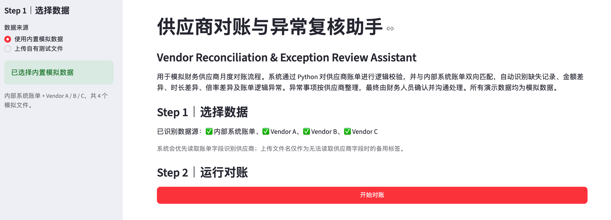

# 供应商对账与异常复核助手

## Vendor Reconciliation & Exception Review Assistant

通过 Python 对供应商账单进行逻辑校验，并与内部系统账单双向匹配，自动识别账单逻辑异常、缺失记录及字段级差异。

[🌐 在线 Demo（待补充）](#在线-demo) · [💻 GitHub Repository](https://github.com/Joyhanz-bot/vendor-reconciliation-assistant)

> **截图占位**：当前仓库尚未包含正式页面截图，未生成假截图。请将主页面截图放入 `screenshots/overview.png`。
>
> 

## 1. 项目简介

这是一个面向财务供应商月度对账场景的 Streamlit 工具。系统读取内部系统账单和多家供应商账单，先执行供应商账单自身逻辑校验，再进行双方双向匹配和字段级差异识别，最后按供应商整理待沟通事项。

项目核心是 Python 对账规则和异常整理，不自动决定最终结算金额。所有异常都需要由财务人员与业务或供应商确认。

## 2. 业务背景

供应商账单与内部系统记录可能在访谈编号、账期、计价时长、倍率和金额上出现不一致。仅看供应商汇总金额难以定位问题，也容易遗漏“系统有、供应商无”或“供应商有、系统无”的记录。

本项目将账单逻辑检查、双向匹配、差异识别和供应商沟通清单放在同一条处理链路中，帮助财务人员快速回答：哪些记录一致，哪些需要确认，应该与谁沟通。

## 3. 核心流程

```text
内部系统账单 + 供应商账单
        ↓
账单读取
        ↓
供应商账单逻辑校验
        ↓
内部系统与供应商双向匹配
        ↓
字段级差异识别
        ↓
按供应商整理待沟通事项
        ↓
财务人员确认与沟通
        ↓
导出对账结果
```

## 4. 核心功能

- 支持内置模拟数据和上传自有测试文件。
- 校验普通访谈、15 分钟进位计价、实际时长计价和数据采买 / 打包价。
- 识别 0 结算、重复访谈编号、跨账期编号和编号末尾异常。
- 进行“系统有 / 供应商无”和“供应商有 / 系统无”的双向匹配。
- 对双方均有的记录识别时长、倍率和金额差异。
- 按供应商拆分展示异常和待沟通事项，并导出 Excel 结果。

## 5. 关键业务逻辑

### 供应商账单逻辑校验

普通访谈根据以下关系核验理论金额：

```text
单价 × 计价时长 × 倍率 = 理论金额
```

同时保留以下业务口径：

- 15 分钟进位计价。
- 实际时长计价。
- 数据采买 / 打包价跳过普通访谈乘法校验。
- 0 结算记录标记为无效访谈。
- 重复访谈编号、跨账期编号和编号末尾异常识别。

### 双向匹配与字段差异

双方均有记录时，继续比较：

- 计价时长差异。
- 倍率差异。
- 金额差异。

如果是小幅时长或金额偏差，页面会提示可能与分钟换算或小数位有关；倍率差异会提示确认录入口径；其他差异则建议核对单价、时长、倍率和供应商选择。系统不会自动决定最终结算金额。

## 6. Python / Semantic Analysis / Human Review 的职责边界

| 模块 | 负责内容 |
| --- | --- |
| Python Rule Engine | 账单计算、编号检查、双向匹配、字段级差异和供应商汇总 |
| Semantic Analysis | 当前公开版本不调用真实 LLM；未来可辅助整理已识别异常的沟通摘要 |
| Human Review | 确认差异原因、补充业务背景，并与供应商沟通处理 |

### 待沟通事项的分类

- `⚠️ 供应商账单自身逻辑异常`：账单内部计算或编号逻辑无法通过校验。
- `🔴 系统有 / 供应商无`：内部系统存在记录，但供应商账单未找到对应编号。
- `🔴 供应商有 / 系统无`：供应商账单存在记录，但内部系统未找到对应编号。
- `🔴 对账差异`：双方都有记录，但时长、倍率或金额存在差异。

## 7. Demo 截图

请将正式截图放入 `screenshots/` 后替换以下占位文件：

| 截图 | 说明 |
| --- | --- |
| `screenshots/overview.png` | 对账概览：展示供应商数量、异常数量和待沟通事项。 |
| `screenshots/exception_review.png` | 异常复核：按供应商查看问题类型、核心原因和建议处理。 |
| `screenshots/vendor_followup.png` | 供应商沟通清单：直接查看内部记录、供应商记录和建议确认方。 |

## 在线 Demo

> 当前未在仓库部署记录或 README 中发现可验证的 Streamlit 公网地址。请部署后将链接补充到顶部“在线 Demo”入口。

## 8. 项目结构

```text
vendor-reconciliation-assistant/
├── app.py                  # Streamlit 页面与对账流程
├── src/
│   ├── logic_checker.py    # 供应商账单逻辑校验
│   ├── reconciler.py       # 双向匹配和字段差异识别
│   ├── exporter.py         # Excel 结果导出
│   └── utils.py            # 通用辅助函数
├── sample_data/            # 内部账单与供应商模拟账单
├── screenshots/            # 页面截图
├── requirements.txt
└── README.md
```

## 9. 如何运行

在项目根目录执行：

```bash
pip install -r requirements.txt
python3 -m streamlit run app.py
```

页面打开后选择内置模拟数据，点击“开始对账”，依次查看对账概览、待沟通事项、账单逻辑校验、双向匹配和结果导出。

## 10. 模拟数据与隐私说明

所有公开数据均为模拟数据，不包含真实企业、员工、供应商、报销凭证或内部制度信息。内部系统账单和 Vendor A、Vendor B、Vendor C 账单仅用于演示对账流程。

## 11. 当前限制

- 对账规则基于当前定义的模拟业务口径，新供应商账单结构可能需要适配。
- 当前版本未连接真实采购、供应商管理或财务结算系统。
- 最终差异处理和结算仍需财务人员确认，系统不提供自动付款或自动调账。
- 当前公开版本没有调用真实 LLM，异常说明来自 Python 规则和固定文案。

## 12. 后续扩展

- 将供应商规则、容差和账单字段 Mapping 配置化。
- 增加更多供应商模板、历史账期对比和异常趋势分析。
- 对接供应商门户、ERP 或财务系统，补充审批和审计日志。
- 按需使用语义模型辅助生成供应商沟通摘要，但不改变 Python 对账结果和人工确认边界。

## 结果导出

页面支持下载 `vendor_reconciliation_result.xlsx`，并保留全量账单逻辑校验、双向匹配、供应商问题汇总、字段级差异及按供应商拆分的异常明细。
